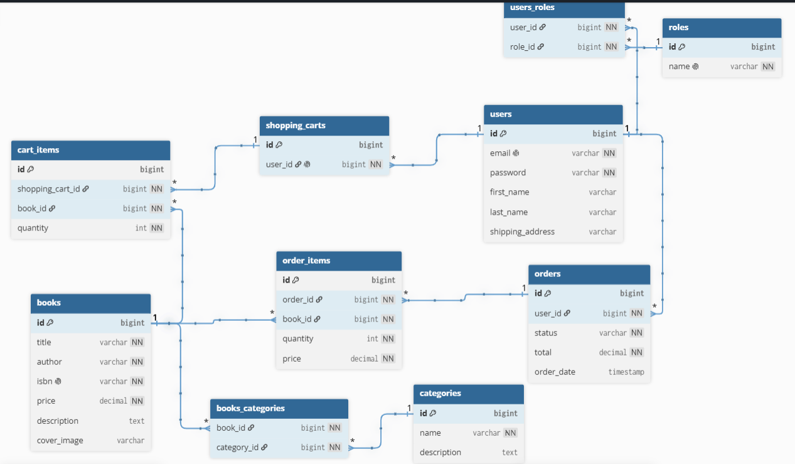

# 📚 Book Store API

A RESTful API for an online bookstore built with Spring Boot. Users can register, browse books, manage their shopping carts and orders, while administrators can manage books, categories, and order statuses.

---

## Technologies Used

| Technology                    | Description                                 |
|-------------------------------|---------------------------------------------|
| ☕ **Java 17**                 | Programming language                        |
| 🚀 **Spring Boot 3.4.5**      | Backend framework                           |
| 🔐 **Spring Security + JWT**  | JWT-based authentication and access control |
| 🗄️ **Spring Data JPA**       | ORM framework                               |
| 🐬 **MySQL**                  | Relational database                         |
| 🌐 **Swagger** | API documentation                           |
| 🧱 **Liquibase**        | Database schema migrations                  |
| 🔄 **MapStruct**        | DTO mapping                                 |
| 🧹 **Lombok**                 | Boilerplate code reduction                  |
| ⚙️ **Maven**                  | Dependency and build management             |
| 🧪 **JUnit & Mockito**        | Unit and integration testing                |
| 🐳 **Docker**                 | Containerization and deployment             |

---

## ✨ Features

- User registration and authentication
- Book and category management
- Shopping cart functionality
- Order processing
- JWT-based security
- Role-based access control
- Swagger API documentation
- Dockerized deployment
- Liquibase database migrations

---
## Database Schema


---

## API Endpoints

### AuthenticationController
- `POST /api/auth/registration` - Register a new user
- `POST /api/auth/login` -  Authenticate user and get JWT token

### BookController
- `POST api/books` - Save a new Book (MANAGER only)
- `GET api/books` - Get a list of all available books
- `GET api/books/{id}` - Get a book by id
- `DELETE api/books/{id}` - Delete a book by id (MANAGER only)
- `PUT api/books/{id}` - Update a book by id (MANAGER only)
- `GET api/books/search` - Search books by title, author

### CartController
- `GET api/cart` - Get current user's shopping cart (USER only)
- `POST api/cart` - Add a book to current user's shopping cart (USER only)
- `PUT api/cart/items/{cartItemId}` - Update quantity of a book in current user's shopping cart (USER only)
- `DELETE api/cart/items/{cartItemId}` - Remove a book from current user's shopping cart (USER only)

### CategoryController
- `POST api/categories` - Save a new Category (MANAGER only)
- `GET api/categories` - Get a list of all available Categories
- `GET api/categories/{id}` - Get a category by id
- `PUT api/categories/{id}` - Update a category by id (MANAGER only)
- `DELETE api/categories/{id}` - Delete a category by id (MANAGER only)
- `GET api/categories/{id}/books` - Get all books by category id

### OrderController
- `POST api/orders` - Create a new order from user's shopping cart (USER only)
- `GET api/orders` - Retrieve current user's order history (USER only)
- `PATCH api/orders/{orderId}` - Update status of an existing order (MANAGER only)
- `GET api/orders/{orderId}/items` - Retrieve all items from a specific order(USER only)
- `GET api/orders/{orderId}/items/{itemId}` - Retrieve a specific item from a specific order (USER only)

---

## 🚀 Getting Started
### Clone repository
```bash
git clone https://github.com/your-username/spring-bookstore.git
cd book-store
```
### Configure enviroment
### 💻 Running Locally

To run the application locally without Docker, make sure MySQL is installed and running.

#### 1. Create a database:

```sql
CREATE DATABASE book_store;
```
#### 2. Update database credentials and JWT secret in `src/main/resources/application.properties`

#### 3. Run the application from your IDE or with:
```bash
mvn spring-boot:run
```

### 🐳 Running with Docker
#### 1. Create a `.env` file in the project root:  
``` env
MYSQLDB_DATABASE=bookstore
MYSQLDB_ROOT_PASSWORD=root

MYSQLDB_LOCAL_PORT=3307
MYSQLDB_DOCKER_PORT=3306

SPRING_LOCAL_PORT=8087
SPRING_DOCKER_PORT=8080

JWT_SECRET=your_secret
JWT_EXPIRATION=300000
```

#### 2. Start the application
```bash
docker compose up --build
```
#### 3. Access the application

**API Base URL**

```text
http://localhost:8087/api
```

**Swagger UI**

```text
http://localhost:8087/api/swagger-ui/index.html
```

## 🧪 Running Tests
```bash
mvn test
```

---
## 📬 Example Requests
### Default Manager Account

| Email | Password |
|-------|----------|
| admin@example.com | adminMate |

#### Register a new User

**POST** `/api/auth/registration`

```json
{
  "email": "user@example.com",
  "password": "password123",
  "repeatPassword": "password123",
  "firstName": "firstName",
  "lastName": "lastName",
  "shippingAddress": "New York"
}
```

### Login

**POST** `/api/auth/login`

```json
{
  "email": "user@example.com",
  "password": "password123"
}
```
Response:

```json
{
  "token": "eyJhbGciOiJIUzI1NiJ9..."
}
```

### Add a book to the shopping cart

**POST** `/api/cart`

Header:

```text
Authorization: Bearer <JWT_TOKEN>
```

Body:

```json
{
  "bookId": 1,
  "quantity": 2
}
```
